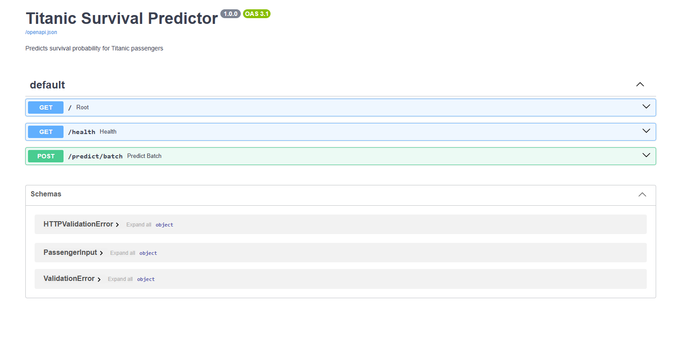

# Titanic API

A machine learning API that predicts whether a Titanic passenger survived based on their passenger information. The API returns both the predicted outcome and the probability of survival.

## Demo


## Tech Stack
- Python, FastAPI, Scikit-learn, Docker

## How it works
The API uses the Titanic dataset, a classic machine learning dataset containing information about passengers aboard the RMS Titanic. The goal is to solve a binary classification problem: predict whether a passenger survived or did not survive. So I chose Logistic Regression as it was performing better than Decision Tree.

The model is trained using passenger features such as age, sex, passenger class, fare etc. The trained model is then integrated into a FastAPI application, which accepts passenger information through a REST API and returns a survival prediction along with its probability.

The API is containerized with Docker, making it easy to build and run consistently across different environments.

## API Endpoints
| Endpoint | Method | Description |
|----------|--------|-------------|
| / | GET | Health check |
| /health | GET | Status |
| /predict | POST | Returns prediction |

## Sample Request
```
curl -X 'POST' \
  'http://127.0.0.1:8000/predict/batch' \
  -H 'accept: application/json' \
  -H 'Content-Type: application/json' \
  -d '[
  {
    "Pclass": 3,
    "Sex_encoded": 1,
    "Age": 22,
    "Fare": 7.30,
    "IsAlone": 0,
    "FamilySize": 4,
    "Title_encoded": 2
  }
]'
```

## Sample Response
```
{
  "predictions": [
    {
      "passenger_index": 0,
      "survived": true,
      "survived_probability": 0.5625
    }
  ],
  "total_passengers": 1
}
```

## Run Locally
1. Clone the repository
   git clone https://github.com/Sunnah25/titanic-api
   cd titanic-api
2. Build the Docker image
   docker build -t titanic-api .
3. Run the container
   docker run -p 8000:8000 titanic-api
4. Open the API documentation
   Visit: http://localhost:8000/docs
   You can also check the API health using: curl http://localhost:8000/health

## Model Performance
- Titanic: Accuracy ~80%, AUC ~0.85
